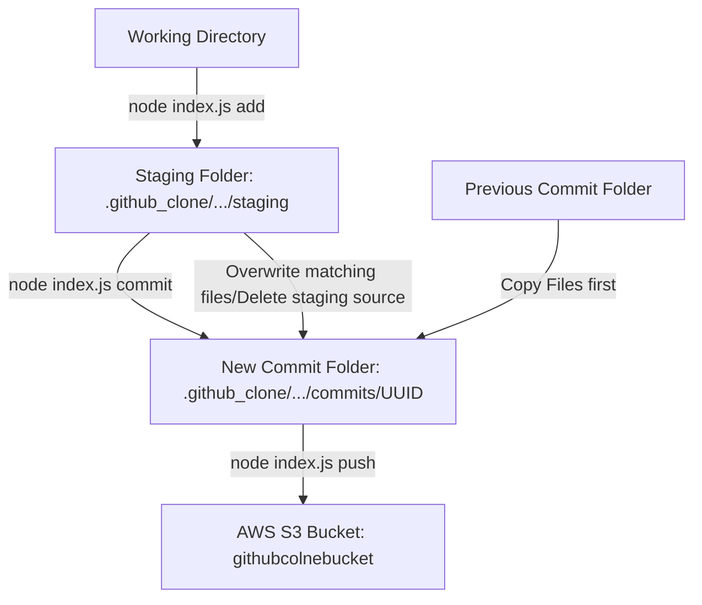

# Custom Version Control System CLI Commands Guide

This document describes how to execute the custom version control CLI commands, their arguments, and the step-by-step internal mechanisms of how they manage files from the staging area to S3 remote commits.

---

## 1. CLI Entrypoint
All CLI commands are executed from the backend directory using Node.js. The CLI uses the `yargs` library to parse commands, options, and positional arguments.

```bash
# Execute directly via Node.js
node index.js <command> <arguments>
```

---

## 2. Command Index & Reference

### `start`
Starts the Express API server and establishes database/WebSocket connections.
* **Usage:**
  ```bash
  node index.js start
  ```
* **Internal mechanism:**
  1. Starts an Express application server listening on the configured `PORT` (default `3000`).
  2. Establishes a connection to the MongoDB database using the connection string in `MONGO_URI`.
  3. Initializes a Socket.io server to allow real-time notifications and rooms for frontend users.

---

### `userInit <user> <pass> <email>`
Creates a new user profile locally and/or in S3.
* **Usage Example:**
  ```bash
  node index.js userInit alice securepass123 alice@example.com
  ```

---

### `init <user> <repo>`
Initializes a new local repository and connects it to a remote database and S3 folder.
* **Usage Example:**
  ```bash
  node index.js init alice my-react-app
  ```
* **Internal mechanism:**
  1. Connects to MongoDB to find the user `alice`. If the user exists, it creates a new repository entry in the database.
  2. Creates the local folder structure inside `.github_clone/`:
     * `.github_clone/alice/my-react-app/commits/`
  3. Writes a local configuration file `.github_clone/alice/my-react-app/config.json` stating the AWS S3 bucket name.
  4. Calls AWS S3 to put a placeholder folder marker object at `alice/my-react-app/` to initialize the remote repository.

---

### `add <user> <repo> <file>`
Stages a file for the next commit by moving it to the repository's local staging area.
* **Usage Example:**
  ```bash
  node index.js add alice my-react-app App.jsx
  ```
* **Internal mechanism:**
  1. Resolves the path to `.github_clone/alice/my-react-app/staging`.
  2. Ensures the `staging` directory exists (creates it recursively if missing).
  3. Copies the target file from the working path into the staging directory.
  4. If it was uploaded as a temporary file inside backend uploads, it unlinks (deletes) the temporary source file.

---

### `commit <user> <repo> <message>`
Takes a snapshot of the repository, combining the previous commit's files with the newly staged files.
* **Usage Example:**
  ```bash
  node index.js commit alice my-react-app "Initial project structure"
  ```
* **Internal mechanism:**
  1. **Generate UUID:** Generates a new unique `UUID v4` to serve as the commit ID.
  2. **Create Commit Folder:** Creates a directory named `.github_clone/alice/my-react-app/commits/<UUID>/`.
  3. **Inherit Previous Snapshot:** 
     * Reads all folders in `commits/` and finds the latest previous commit by checking directory modification times (`mtime`).
     * If a previous commit exists, it copies all files (except `commit.json` and `message.txt`) from that previous commit folder into the new commit folder.
  4. **Apply Staged Changes (Overwrite/Add):**
     * Reads the files inside the `staging/` folder.
     * Copies each staged file into the new commit folder. If a file with the same name was already copied from the previous commit, it **overwrites and replaces** it with the new version.
     * Deletes the file from the `staging/` directory so the staging area is cleared for the next cycle.
  5. **Save Metadata:**
     * Writes `commit.json` inside the new commit folder containing:
       ```json
       {
         "id": "<UUID>",
         "message": "Initial project structure",
         "timestamp": "2026-06-22T14:00:00.000Z"
       }
       ```
     * Writes the commit message text to `message.txt` in the commit folder.

---

### `push <user> <repo>`
Syncs local commits to AWS S3 remote storage.
* **Usage Example:**
  ```bash
  node index.js push alice my-react-app
  ```
* **Internal mechanism:**
  1. Reads all commit folders inside `.github_clone/alice/my-react-app/commits/`.
  2. Lists all objects in S3 under `alice/my-react-app/commits/` using `listObjectsV2` to identify which commits have already been pushed.
  3. Filters for new commits. For each new commit:
     * Uploads the snapshotted files to S3.
     * Uploads the commit metadata to S3 as `alice/my-react-app/commits/<commitId>/commit.json`.
  4. Uploads a `HEAD.json` file to the root of the repository folder in S3 to point remote queries to the latest commit UUID.

---

### `pull <user> <repo>`
Downloads all remote commits from S3 to update local repository history.
* **Usage Example:**
  ```bash
  node index.js pull alice my-react-app
  ```
* **Internal mechanism:**
  1. Queries S3 using `listObjectsV2` with prefix `alice/my-react-app/commits/` to find all remote files.
  2. Downloads the data for each key via `getObject`.
  3. Creates the matching directory path locally inside `.github_clone/alice/my-react-app/commits/<commitId>/`.
  4. Writes the file contents locally, mirroring the remote repository state on S3.

---

### `revert <user> <repo> <commit_id>`
Reverts the repository file tree to the exact state of a specified commit ID.
* **Usage Example:**
  ```bash
  node index.js revert alice my-react-app 550e8400-e29b-41d4-a716-446655440000
  ```
* **Internal mechanism:**
  1. Checks if the target commit folder exists under `.github_clone/alice/my-react-app/commits/<commit_id>`.
  2. Generates a new unique `UUID v4` for the revert commit.
  3. Copies the entire file tree recursively from the target commit folder to the new commit folder (skipping `commit.json` and `message.txt`).
  4. Saves the metadata inside the new commit folder with a message indicating it is a revert of `<commit_id>`.

---

## 3. Visual Flow of Staging & Committing

Here is a visual map of how a file moves through version control operations:


