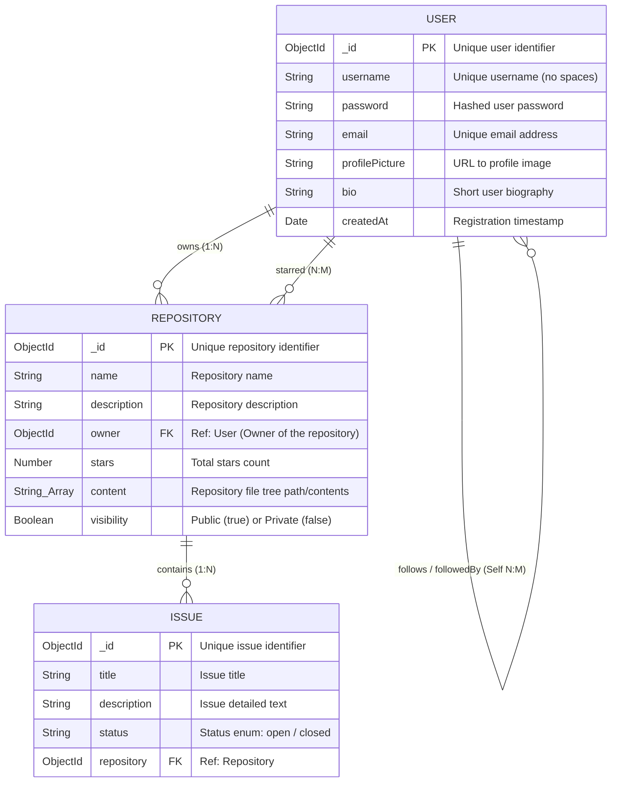

# CodeVault Database Entity-Relationship (ER) Diagram

This document contains the visual Entity-Relationship (ER) diagram and the corresponding raw code for the CodeVault MongoDB database schemas.

---

## 1. ER Diagram (Visual)

The database schema consists of three collections (`users`, `repositories`, and `issues`) with relationships representing ownership, stars, social follows, and issue tracking.



---

## 2. Raw Mermaid Diagram Code

You can copy the Mermaid block below to render the ER diagram in markdown viewers, GitHub, or Mermaid Live Editor:

```text
erDiagram
    USER {
        ObjectId _id PK "Unique user identifier"
        String username "Unique username (no spaces)"
        String password "Hashed user password"
        String email "Unique email address"
        String profilePicture "URL to profile image"
        String bio "Short user biography"
        Date createdAt "Registration timestamp"
    }

    REPOSITORY {
        ObjectId _id PK "Unique repository identifier"
        String name "Repository name"
        String description "Repository description"
        ObjectId owner FK "Ref: User (Owner of the repository)"
        Number stars "Total stars count"
        String_Array content "Repository file tree path/contents"
        Boolean visibility "Public (true) or Private (false)"
    }

    ISSUE {
        ObjectId _id PK "Unique issue identifier"
        String title "Issue title"
        String description "Issue detailed text"
        String status "Status enum: open / closed"
        ObjectId repository FK "Ref: Repository"
    }

    USER ||--o{ REPOSITORY : "owns (1:N)"
    USER ||--o{ REPOSITORY : "starred (N:M)"
    USER ||--o{ USER : "follows / followedBy (Self N:M)"
    REPOSITORY ||--o{ ISSUE : "contains (1:N)"
```

---

## 3. Relationships and Schema Design Analysis

### A. User $\leftrightarrow$ Repository Ownership (1:N)
* **Model Representation:** 
  * In `userModel.js`, the user has a `repositories` array: `repositories: [{ type: Schema.Types.ObjectId, ref: "Repository" }]`.
  * In `repoModel.js`, each repository points back to the owner: `owner: { type: Schema.Types.ObjectId, ref: "User", required: true }`.
* **Execution:** When a repository is created, its `owner` is set to the user's `_id`, and its own `_id` is pushed to the user's `repositories` array.

### B. User $\leftrightarrow$ Repository Starred (N:M)
* **Model Representation:** 
  * In `userModel.js`, users track starred repositories: `starredRepos: [{ type: Schema.Types.ObjectId, ref: "Repository" }]`.
  * The Repository's `stars` count is updated dynamically when a user toggles a star.
* **Execution:** A user can star multiple repositories, and a repository can be starred by multiple users.

### C. User $\leftrightarrow$ User Follows / Followers (Self N:M)
* **Model Representation:**
  * Self-referencing fields in `userModel.js`:
    * `following: [{ type: Schema.Types.ObjectId, ref: "User" }]`
    * `followers: [{ type: Schema.Types.ObjectId, ref: "User" }]`
* **Execution:** A user can follow multiple users, and a user can have multiple followers, creating an asymmetrical self-referencing relationship.

### D. Repository $\leftrightarrow$ Issue (1:N)
* **Model Representation:**
  * In `repoModel.js`, the Repository schema contains a reference array of issues: `issues: [{ type: Schema.Types.ObjectId, ref: "Issue" }]`.
  * In `issuesModel.js`, the Issue schema points to the target repository: `repository: { type: Schema.Types.ObjectId, ref: "Repository", required: true }`.
* **Execution:** An issue can only belong to one repository, but a repository can house multiple issues.

### E. Compound Database Indexes
* **Unique Key Constraint:** In `repoModel.js`, a unique compound index is created on `{ owner: 1, name: 1 }`:
  ```javascript
  RepositorySchema.index({ owner: 1, name: 1 }, { unique: true });
  ```
  This ensures that a single user cannot create two repositories with the same name, although different users *can* have repositories with the exact same name (e.g., `alice/test-repo` and `bob/test-repo` can both exist).

### F. Absence of Commit Collection in MongoDB (VCS Decoupling)
* **Architectural Design:** There is **no `Commit` collection** in MongoDB, nor do User or Repository models contain any references to commits.
* **Why this design was chosen:**
  1. **Source of Truth:** Commit snapshots are stored as raw physical files on the local filesystem (inside `.github_clone/`) and on remote object storage (AWS S3). They do not require structured relational mapping.
  2. **Stateless Metadata Database:** Decoupling version control files from MongoDB keeps the database stateless regarding file history. This avoids storing massive binary directory configurations inside MongoDB BSON documents.
  3. **Dynamic Resolution:** When the frontend or CLI needs commit histories, the backend queries S3 dynamically using `s3.listObjectsV2` or scans directories using `fs.readdir` instead of querying the database.

