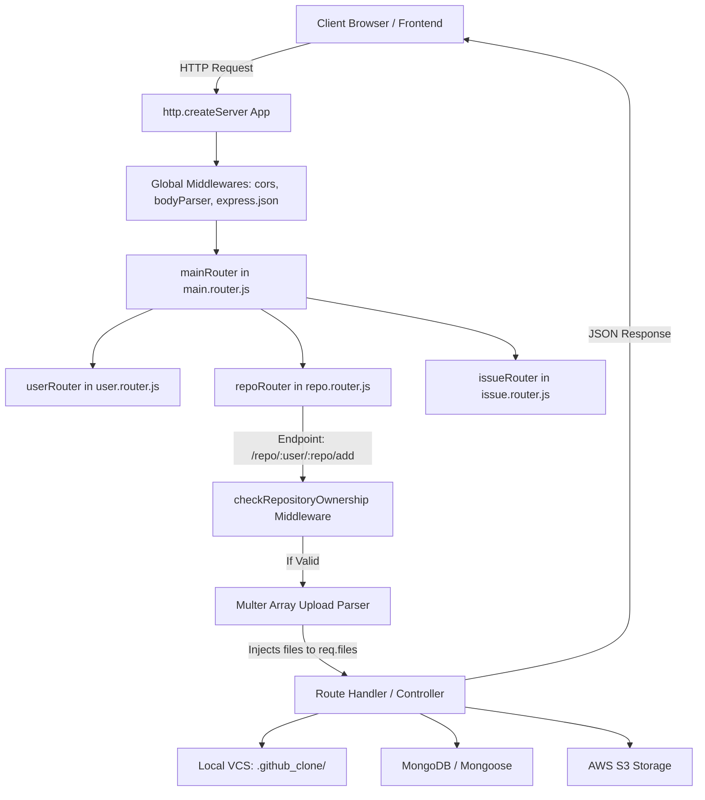

# CodeVault: URL Handling, Routing, & Request Lifecycle

This document provides a comprehensive analysis of the request lifecycle inside the CodeVault backend. It details how HTTP requests and CLI commands are captured, routed, verified by middleware, and processed by controllers.

---

## 1. Request Lifecycle Overview

When a client sends a request to the CodeVault server, it flows through multiple layers of the application stack. Here is the path of an incoming HTTP request:



---

## 2. Server Initialization (`index.js`)

The backend entry point is [backend/index.js](file:///Users/apple/Jasmita_Vekariya/Sem%205/AT/CodeVault/backend/index.js). When run with the `start` command (`node index.js start`), it initializes the HTTP server:

1. **Global Middleware Registration:**
   * **CORS (Cross-Origin Resource Sharing):** Configured to allow requests from the React development server (`http://localhost:5173`) and support credentials (cookies, headers).
   * **Body Parser:** Parsers for JSON (`bodyParser.json()`) and URL-encoded bodies (`bodyParser.urlencoded({ extended: true })`) parse raw string payloads into `req.body`.
2. **Main Router Binding:** Appends the main router at `/` path:
   ```javascript
   app.use("/", mainRouter);
   ```
3. **Database Connection:** Connects to MongoDB via Mongoose and waits for a successful hook.
4. **Socket.io Integration:** Attaches Socket.io to the HTTP server for real-time room communication.

---

## 3. Router Hierarchy & Delegation

CodeVault structures its endpoints hierarchically to maintain clean separation of concerns:

### A. Main Router ([main.router.js](file:///Users/apple/Jasmita_Vekariya/Sem%205/AT/CodeVault/backend/routes/main.router.js))
Acts as the central gateway. It imports and mounts the child routers:
```javascript
mainRouter.use("/", userRouter); 
mainRouter.use("/", repoRouter); 
mainRouter.use("/", issueRouter); 
```

### B. User Router ([user.router.js](file:///Users/apple/Jasmita_Vekariya/Sem%205/AT/CodeVault/backend/routes/user.router.js))
Handles authentication and social features:
* `POST /signup` & `POST /login` $\rightarrow$ Handled by `userController.signup` / `login`
* `GET /userProfile/:id` $\rightarrow$ Profile metadata retrieval
* `POST /follow` $\rightarrow$ User following systems

### C. Repo Router ([repo.router.js](file:///Users/apple/Jasmita_Vekariya/Sem%205/AT/CodeVault/backend/routes/repo.router.js))
Manages repository CRUD and VCS syncing operations (detailed below).

### D. Issue Router ([issue.router.js](file:///Users/apple/Jasmita_Vekariya/Sem%205/AT/CodeVault/backend/routes/issue.router.js))
Tracks issues associated with repositories.

---

## 4. Middleware Analysis: `checkRepositoryOwnership`

The repository ownership middleware ([repoOwnershipMiddleware.js](file:///Users/apple/Jasmita_Vekariya/Sem%205/AT/CodeVault/backend/middleware/repoOwnershipMiddleware.js)) is executed on writing operations to ensure users can only modify their own repositories.

### Detailed Lifecycle of the Middleware:
1. **Extraction:**
   * Extracts `user` (owner's username) and `repo` (repository name) from request parameters (`req.params`).
   * Extracts `currentUserId` from request headers (`req.headers['user-id']`).
2. **Sanity Checks:**
   * If `currentUserId` is missing, returns `401 Unauthorized`.
   * If the format of `currentUserId` is not a valid MongoDB ObjectId, returns `400 Bad Request`.
3. **Database Retrieval:**
   * Looks up the repository using `Repository.findOne({ name: repo }).populate('owner')`.
   * If the repository is not found, returns `404 Not Found`.
4. **Security Isolation (Anti-Enumeration):**
   * Checks if `repository.owner.username !== user`. If they do not match, returns `404 Not Found` (rather than a 403) to prevent unauthorized users from checking if a repository exists under a username.
5. **Authorization Verification:**
   * Compares `repository.owner._id.toString()` with `currentUserId`.
   * If they do not match, returns `403 Access Denied`.
6. **Execution Pass-Through:**
   * If all checks pass, it attaches `req.repository = repository` to the request object so subsequent handlers do not have to query the database again.
   * Calls `next()` to hand execution to the actual route handler.

---

## 5. Walkthrough of Core Request Flows

Here is exactly how specific operations execute step-by-step from URL to database/file storage:

### A. File Upload & Staging (`POST /repo/:user/:repo/add`)
This endpoint places files into the staging area (comparable to `git add`).

```
[POST /repo/alice/my-project/add]
               │
               ▼
   [checkRepositoryOwnership] (Validates Alice owns 'my-project')
               │
               ▼
     [multer.array("files")] (Parses multipart upload, stores in uploads/)
               │
               ▼
    [Route Handler Callback]
               │
               ▼
     [Loop: addRepo()] (Copies files from uploads/ to .github_clone/alice/my-project/staging/)
```

* **Step 1:** The frontend sends a `multipart/form-data` request with files attached to the key `files`.
* **Step 2:** The `checkRepositoryOwnership` middleware checks permissions.
* **Step 3:** Multer handles the stream parsing, writing files temporarily into the `uploads/` folder, and injecting an array of file metadata objects into `req.files`.
* **Step 4:** The route handler loops over `req.files` and calls the `addRepo` controller function:
  * `addRepo` calculates the staging path: `.github_clone/<user>/<repoName>/staging`.
  * Creates this directory if missing (`fs.mkdir`).
  * Copies the file from its temporary uploads path to the staging directory using `fs.copyFile` with its original name.
* **Step 5:** Returns a success JSON response detailing how many files were successfully staged.

### B. Committing Changes (`POST /repo/:user/:repo/commit`)
Creates a new snapshot representing a version commit (comparable to `git commit`).

1. **Routing:** Matches `/repo/:user/:repo/commit`, executes ownership checks, and reads `req.body.message`.
2. **Directory Creation:** The `commitRepo` controller generates a new UUID using the `uuid` library and creates a directory: `.github_clone/<user>/<repo>/commits/<commitId>`.
3. **Tree Reconstruction:**
   * Reads all subdirectories inside `.github_clone/<user>/<repo>/commits/`.
   * Finds the latest previous commit by reading the directory modification times (`stats.mtime`) and sorting them chronologically.
   * Copies all files from the latest previous commit into the newly created commit directory (excluding metadata files `commit.json` and `message.txt`).
4. **Staging Merge:**
   * Reads the staging directory (`.github_clone/<user>/<repo>/staging`).
   * Copies all staged files into the new commit directory, overwriting old versions of files.
   * Deletes the files from the staging directory (`fs.unlink`), effectively clearing the staging area.
5. **Metadata Writing:**
   * Writes `commit.json` containing the commit ID, timestamp, and message.
   * Writes `message.txt` containing the message string.

### C. Pushing to S3 (`POST /repo/:user/:repo/push`)
Uploads local commits to AWS S3 (comparable to `git push`).

1. **Routing:** Matches `/repo/:user/:repo/push` and executes ownership validation.
2. **S3 Diff Checks:**
   * Queries S3 using `s3.listObjectsV2` with prefix `${user}/${repo}/commits/` to find commits already stored in the cloud.
   * Reads the local `commits` directory.
   * Filters out any commits that are already present in the S3 bucket.
3. **Commit Uploading:**
   * For each new commit, reads all files in its directory.
   * Reads file contents using `fs.readFile` and uploads them to S3 under key `${user}/${repo}/commits/${commitId}/${fileName}` using `s3.upload(...)`.
   * Builds and uploads the commit metadata to S3 under `${user}/${repo}/commits/${commitId}/commit.json`.
4. **HEAD Reference Update:**
   * Finds the latest commit locally by modification time.
   * Creates a payload indicating the primary branch points to this commit: `{ branch: "main", latestCommit: "<commitId>" }`.
   * Uploads this file to S3 under `${user}/${repo}/HEAD.json`. This acts as the remote HEAD reference pointing to the latest version.

### E. Reverting Commits (`POST /repo/:user/:repo/revert/:commitId`)
Reverts the repository state back to a previous commit (comparable to `git revert`).

1. **Verification:** Validates that the target `commitId` directory exists locally under `commits/`.
2. **Clean Repository Root:** Calls `emptyRepoRootExceptInternal(repoPath)` which deletes all files in the repository root directory except for the internal `commits` and `staging` directories.
3. **Restore File Tree:** Recursively copies all files from the target commit directory back into the repository root.
4. **Commit & Push Sync:**
   * Creates a brand new commit (with a new UUID) copying the exact state. The commit message is prepended with `"Revert: <original-message>"`.
   * Calls `revertCommitRepo(user, repoName, revertMsg, commitId)` directly to create a new commit.
   * Calls `pushRepo(user, repo)` directly to sync this newly generated commit and update the HEAD pointer in S3 immediately.

### F. Download Latest ZIP (`GET /repo/:user/:repo/download/latest`)
Dynamically archives and streams the repository files.

1. **Latest Commit Discovery:**
   * Lists all objects under `${user}/${repo}/commits/` from S3.
   * Parses the keys to identify all commit IDs.
   * Checks the `LastModified` timestamps of these S3 keys to find the latest active commit.
2. **File Gathering:**
   * Queries S3 for all objects matching the prefix of the latest commit (`${user}/${repo}/commits/${latestCommitId}/`).
3. **Piped Archive Stream:**
   * Configures HTTP headers: `Content-Type: application/zip` and `Content-Disposition: attachment; filename="..."`.
   * Instantiates `archiver("zip")`.
   * Pipes the archiver instance directly to the Express `res` object (`archive.pipe(res)`).
   * For each file key returned from S3, opens an S3 read stream using `s3.getObject(...).createReadStream()` and appends it to the zip archive.
   * Calls `archive.finalize()` to complete the compression and stream the zipped file directly to the client's browser.
